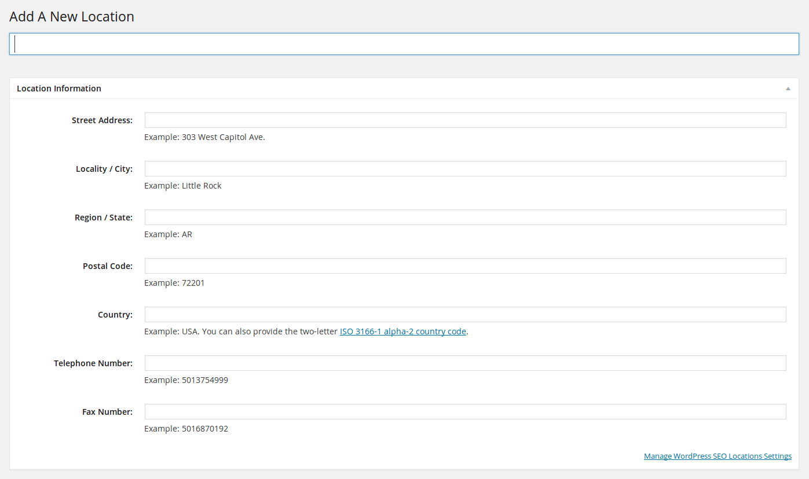

#WordPress SEO Locations Plugin

WordPress SEO Locations was built by developers, for developers. This plugin makes it easy to display one or multiple locations with proper Schema.org markup, Google Static Map images, and links to directions in Google Maps. Our goal is to provide WordPress developers a bare bones SEO location plugin that just works. There are no styles to override, and customizing the HTML output is quick and simple.

Please read [The Google Geocoding API Documentation](https://developers.google.com/maps/documentation/geocoding/) and [The Static Maps API Documentation](https://developers.google.com/maps/documentation/staticmaps/) regarding API key requirements, and usage limits. Although API keys are not required to use this plugin, it is highly suggested. We are working on building a caching solution that complies with Google's Terms of Service to help alleviate Google Static Maps usage limits in the future. Also, in order to cut down on the number of geocode requests per second, we only request data for locations upon saving (Post and Update) each location.

##Locations

This plugins creates the "Locations" post type with just the options you need to add [W3C valid HTML](http://validator.w3.org) addresses with [schema.org](http://schema.org) markup to your website, including:

 - Street Address
 - Locality / City
 - Region / State
 - Postal Code
 - Country
 - Telephone Number
 - Fax Number

##Settings

The Locations settings page enables you to customize the look and feel of the Google Map images pulled in for all of your locations, including:

 - Map Type
 	- Roadmap
 	- Satelite
 	- Terrain
 	- Hybrid
 - Image Type
 	- png32 (Highest Quality)
 	- gif (High Quality)
 	- png8 (Medium Quality)
 	- jpg (Low Quality)
 	- jpg-baseline (Lowest Quality)
 - Pin Color (HEX)
 - Map Width (1-640px)
 - Map Height (1-640px)
 - Map Zoom (0-21)

##Instalation

Installation is just like any other WordPress plugin. Just drop the `wp-seo-locations` folder into your plugins folder and activate it via the Plugins Administration page.

##Usage

Displaying locations is easy. Just use the `[wpseol]` shortcode or call the `print_wpseo_locations()` function in your theme. By default, both options print all locations. If you want to be more specific, use the `ids` option to specify which locations to print. Location titles, Maps, Fax Numbers, and Telephone numbers are not printed by default, but can be easily enabled using the `titles`, `maps`, `phones`, and `faxes` options. Last, but not least, use the `classes` option to add classes to each location. Here are some examples:
	
###[wpseol]:

    //print the address of all locations with schema.org markup and a link to google maps.
    [wpseol]

    //only print locations with the specified id's
    [wpseol ids="153,154"]

    //with titles
    [wpseol titles="true"]

    //with maps
    [wpseol maps="true"]

    //with phone numbers
    [wpseol phones="true"]

    //with fax numbers
    [wpseol faxes="true"]

    //with classes
    [wpseol classes="small-12 medium-6 large-3 columns"]

    //All options
    [wpseol ids="154,122" titles="true" maps="true" phones="true" faxes="true" classes="small-12 medium-6 large-3 columns"]

###print_wpseo_locations():

    //print the address of all locations with schema.org markup and a link to google maps.
    print_wpseo_locations();

    //only print locations with the specified id's
    print_wpseo_locations(array('ids'=>array(153,154)));

    //with titles
    print_wpseo_locations(array('titles'=>true));

    //with maps
    print_wpseo_locations(array('maps'=>true));
    
    //with phone numbers
    print_wpseo_locations(array('phones'=>true));

    //with fax numbers
    print_wpseo_locations(array('faxes'=>true));

    //with classes
    print_wpseo_locations(array('classes'=>'small-12 medium-6 large-3 columns'));

    //All options
    print_wpseo_locations(array('ids'=>array(153,154),'titles'=>true,'maps'=>true,'phones'=>true,'faxes'=>true,'classes'=>'small-12 medium-6 large-3 columns'));

###Example Output

Below is a formatted/readable example of the output for a single location:

    

        Main Office
        <a 
          class="address" 
          itemprop="address"
          itemscope="" 
          itemtype="http://schema.org/PostalAddress"
          href="https://www.google.com/maps/dir/303 W. Capitol Ave. Little Rock, AR 72201">
            
            
              303 W. Capitol Ave.
            
            
              Little Rock
            ,
            
              AR
            
            
              72201
            
        </a>
        <a
          href="tel:5012217888"
          class="telephone"
          title="5012217888"
          itemprop="telephone">
          501-221-7888
        </a>
    

##Customize!

We built this plugin with developers and custom themes in mind. If you don't like the way the HTML for each location is generated, change it! Just copy and paste the `print_wpseo_locations()` function at the bottom of `/wp-seo-locations/wp-seo-locations.php` into your theme's `functions.php` file, change it's name, and customize the HTML to suit your specific needs. Check out the example below:

###Our Function:

    add_shortcode( 'wpseol', 'print_wpseo_locations' );
    function print_wpseo_locations($atts, $content = null){
    	//shortcode function stuffs here
    }

###Your Custom Function:

    add_shortcode( 'locations', 'print_my_locations' );
    function print_my_locations($atts, $content = null){
    	//shortcode function stuffs here
    }

Remember to use your new `locations` shortcode and `print_my_locations()` function instead if you decide to customize.

##Roadmap

We have detailed some of our goals (no guarantees) for the future of this plugin below:

 - Static map image caching with a flush every 30 days to comply with Google's Terms of Service.
 - The ability to print a static map with all locations.
 - The ability to embed a JavaScript map with all locations. 

##FAQ

Why did you use the geocoding API to retrieve the latitude and longitude for each location?

>While we could have easily passed the location's address into the Static Maps URL, we recognized that our future plans of implementing embeded JavaScript maps would require a latitude & longitude. Since calls to the geocoding service only happen when you "Post" or "Update" a location, unless you are doing something fishy, it's highly unlikely you will exceed usage limits.

##Contributors

This plugin was developed by:

- [Steven Leimberg](https://github.com/smleimberg), Software Developer for [Matmon Internet Inc.](http://www.matmon.com).

##License

This program is free software; you can redistribute it and/or modify it under the terms of the GNU General Public License, version 2, as published by the Free Software Foundation.

This program is distributed in the hope that it will be useful, but WITHOUT ANY WARRANTY; without even the implied warranty of MERCHANTABILITY or FITNESS FOR A PARTICULAR PURPOSE.  See [gpl.txt](gpl.txt) for more details.